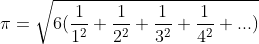
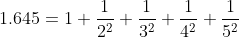
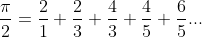
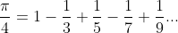
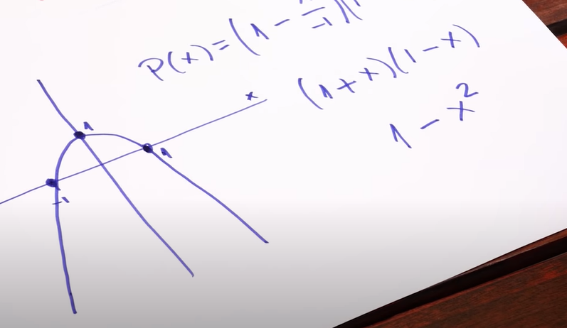
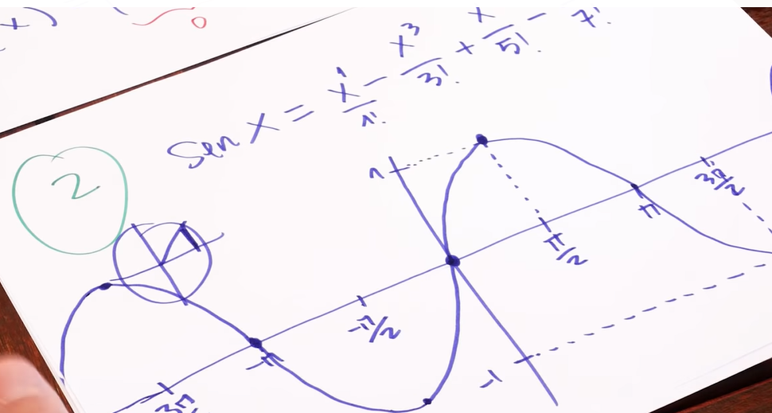
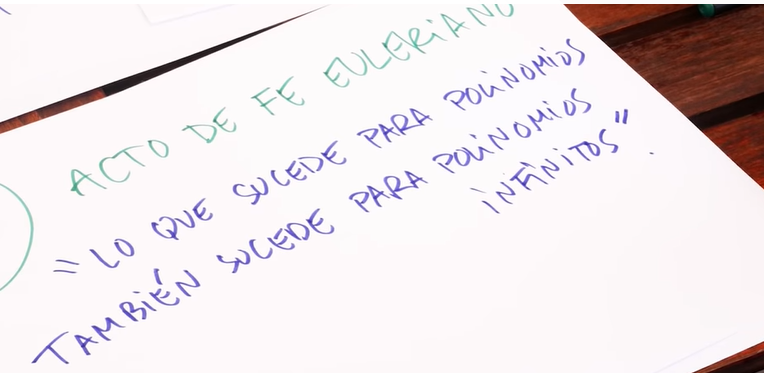

# Challenge - El-Problema-de-Basilea-Calculando-PI

π (pi) es sin duda una de las constantes matemáticas más importantes de todos los tiempos. Todos conocemos el valor de π (pi) , bueno, quizás solo sus primeros decimales.

``3.1415``

Es por ello que en esta ocasión es necesarios que implementes el Problema de Basilea para encontrar el "valor" de π (pi).

Es obligatorio obtener por lo menos los primeros 6 decimales.

## Para calcular PI

  

## Resultado

* El archivo de solución se encuentra en main.py
* Haciendo una aproximación con 9 valores se optiene:

`El valor de PI es: 3.14159264498239`

# Teoría del problema a resolver

## El Problema de Basilea (Teoria)

En 1734 el joven Leonhard Euler sorprendía a la comunidad matemática resolviendo uno de los problemas que había tenido en vilo a los matemáticos más relevantes de toda Europa: ¡EL PROBLEMA DE BASILEA!. Nadie podía imaginar que el número PI estaba implicado en esta intriga.

### Series (Sumas infinitas)

1 + 1 + 1 + 1 + 1 + 1 + 1 + 1 ... = infinito

0.9 + 0.99 + 0.999 + 0.99999 ... = 1

**Serie armonica**

1 + 1/2 + 1/3 + 1/4 + 1/5 + ... = Infinito

¡EL PROBLEMA DE BASILEA!. **¿Cuál es la suma de la serie infinita de los inversos de los cuadrados?**

> Basilea era la ciudad natal de Euler y la familia Bernoulli

Varios matemáticos hicieron aproximaciones al problema

  

  

Leibniz

  

Hasta que Euler, después de 3 años pudo probar que la suma es exactamente igual a 

  

La aproximación de Euler consistio en lo siguiente

1. Función cuadrática

  

2. Función seno

  

3. Acto de fé

  

## Calculando PI

Para calcular PI basta con despejar de la serie para hacer una aproximación

**Fuente:**
https://www.youtube.com/watch?v=wvXZn4OdExU
https://es.wikipedia.org/wiki/Problema_de_Basilea

## Formulas implementadas con: 
https://www.codecogs.com/latex/eqneditor.php